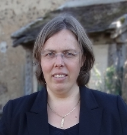
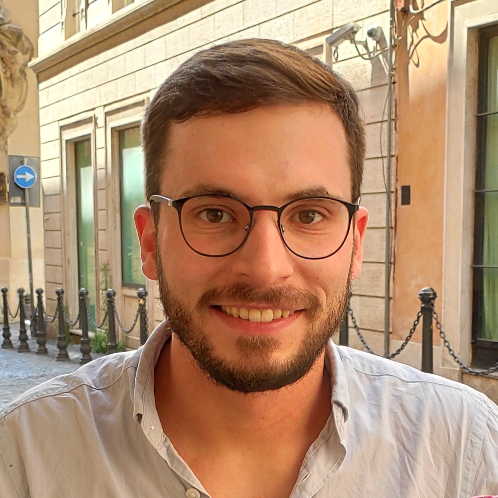
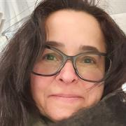
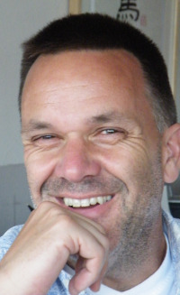

### 33rd EACSL Annual Conference on

## Computer Science Logic 2025

{:refdef: style="text-align: center;"}

{: refdef}

### 10-14 February 2025, Amsterdam, the Netherlands

#### About

[CSL](https://www.eacsl.org/csl-conferences/) is the annual conference of the European Association for Computer Science Logic ([EACSL](https://www.eacsl.org/)).
It is an interdisciplinary conference, spanning across both basic and application oriented research in mathematical logic and computer science.

{:refdef: style="text-align: center;"}
{: height="70hv" }&nbsp;&nbsp;&nbsp;
{: height="70hv" }
{: refdef}

CSL 2025 will be held on the 10th–14th of February 2025 and is organised jointly by the [Theoretical Computer Science group](https://www.cs.vu.nl/~tcs/) at the Vrije Universiteit Amsterdam and [ILLC](https://www.illc.uva.nl/) at the University of Amsterdam.

#### Co-located Workshops

Two workshops are co-located with CSL, and will take place on Monday, February 10:

[12th Logic Mentoring Workshop (LMW@CSL 2025)](https://logic-mentoring-workshop.github.io/csl25/)

[Workshop on Learning and Logic (LeaLog@CSL 2025)](https://sites.google.com/view/lealog25)

#### Important dates

{::options parse_block_html="true" /}

| Abstract submission: | July 18th, 2024 AoE |
| Paper submission: | July 23rd, 2024 AoE |
| Notification: | October 27th, 2024 AoE ([accepted papers](accepted.html))|
| Final Version Due: | November 24th, 2024 AoE |
| Conference: | February 10th-14th, 2025 |

#### Submission guidelines

Submitted papers must be in English and must provide sufficient detail to allow the Program Committee to assess the merits of the paper.
Authors must submit their papers through the CSL 2025 Easychair submission site at [Easychair](https://easychair.org/my/conference?conf=csl2025) as a single PDF file.
Full proofs may appear in a clearly marked technical appendix which will be read at the reviewers’ discretion.
Authors are strongly encouraged to include a well written introduction which is directed at all members of the PC.

The papers should be submitted via [Easychair](https://easychair.org/my/conference?conf=csl2025).

The conference proceedings will be published in [Leibniz International Proceedings in Informatics (LIPIcs)](https://submission.dagstuhl.de/documentation/authors).

Authors are invited to submit contributed papers of no more than 15 pages in LIPIcs style (not including references), presenting unpublished work fitting the scope of the conference.
Papers may not be submitted concurrently to another conference with refereed proceedings. The PC chairs should be informed of closely related work submitted to a conference or a journal.

Papers authored or co-authored by members of the PC (but not PC chairs) are allowed.

The submissions are **double-blind**:

- Authors are not allowed to put their name on the paper, and they should avoid revealing their identities in text (references to previous or related work should be in third-person).
- Authors are allowed to disseminate the work on public repositories (e.g. on arXiv or their websites).

We ask authors to declare conflicts with PC members when they submit their paper in Easychair.

At least one of the authors of each accepted paper is expected to register for the conference and attend it in person or online, in order to present their papers.

#### Topics

- automated deduction and interactive theorem proving
- concurrency and distributed computation
- constructive mathematics and type theory
- equational logic and term rewriting
- automata and games, game semantics
- formal methods
- model checking
- decision procedures
- modal and temporal logic
- description logics
- logical aspects of computational complexity
- logical aspects of AI
- finite model theory
- computability
- computational proof theory
- logic programming and constraints
- lambda calculus and combinatory logic
- domain theory
- categorical logic and topological semantics
- database theory
- specification, extraction and transformation of programs
- logical aspects of quantum computing
- logical foundations of programming paradigms
- verification and program analysis
- linear logic
- higher-order logic
- knowledge representation and reasoning
- nonmonotonic reasoning

#### Helena Rasiowa award

The [Helena Rasiowa Award](https://www.eacsl.org/helena-rasiowa-award-2/) is the best student paper award for the CSL conference series, starting from CSL 2022.
The award will be given to the best paper (as decided by the PC) written solely by students or for which students were the main contributors.
A student in this context is any person who is currently studying for a degree or whose PhD award date is less than one year prior to the first day of the conference.

Read more about the contribution of [Helena Rasiowa](https://en.wikipedia.org/wiki/Helena_Rasiowa) to logic and computer science, and their interplay, [here](https://www.eacsl.org/helena-rasiowa-award-2/helena-rasiowa-award/).

#### Invited speakers

<ul style="list-style-type:none;padding-left:20px">
  <li> Patricia Bouyer-Decitre (CNRS, ENS Paris-Saclay, France)</li>
  <li> Yannick Forster (Inria Paris, France)</li>
  <li> Elaine Pimentel (University College London, UK)</li>
  <li> Yde Venema (Universiteit van Amsterdam, the Netherlands)</li>
</ul>

---

#### Committees

##### Chairs

- Jörg Endrullis (Vrije Universiteit Amsterdam, the Netherlands)
- Sylvain Schmitz (Université Paris Cité, France)

##### Program Committee

- Bahareh Afshari (University of Gothenburg, Sweden)
- Sandra Alves (University of Porto, Portugal)
- Camille Bourgaux (CNRS, ENS Paris, France)
- Laura Bozzelli (Napoli, Italy)
- Paul Brunet (Université Paris-Est Créteil, France)
- Corina Cîrstea (University of Southampton, UK)
- Laure Daviaud (City University London, UK)
- Anuj Dawar (University of Cambridge, UK)
- Natasha Fernandes (Macquarie University, Sydney, Australia)
- Dana Fisman (Ben-Gurion U., Israel)
- Moses Ganardi (MPI-SWS Kaiserslautern, Germany)
- Rob J. van Glabbeek (UNSW, Sydney, Australia)
- Julien Grange (Université Paris-Est Créteil, France)
- Robert Harper (Carnegie Mellon University, USA)
- Antti Kuusisto (Tampere University, Finland)
- Ugo Dal Lago (University of Bologna, Italy)
- Assia Mahboubi (Inria Nantes, France)
- Alessio Mansutti (IMDEA Software Institute, Spain)
- Dale Miller (Inria Saclay, France)
- Shankara Narayanan Krishna (IIT Bombay, India)
- Davide Sangiorgi (University of Bologna, Italy)
- Mahsa Shirmohammadi (CNRS, IRIF, France)
- Alwen Tiu (Australian National University, Australia)
- Takeshi Tsukada (Chiba University, Japan)
- Benoît Valiron (CentraleSupélec, France)
- Thomas Zeume (Ruhr University Bochum, Germany)
- Standa Živný (University of Oxford, UK)

##### Organisation committee

- Wan Fokkink (Vrije Universiteit Amsterdam, the Netherlands)
- Emma Triesman (Vrije Universiteit Amsterdam, the Netherlands)

---
#### Venue and local information

CSL 2025 will take place at [CWI](https://www.cwi.nl/en/), the research institute for mathematics & computer science in the Netherlands. The address is [Science Park 123, 1098 XG Amsterdam](https://www.openstreetmap.org/way/57861985).

{:refdef: style="text-align: center;"}
{: width="60%" }
{: refdef}

##### Anti-harassment policy

[EACSL](https://www.eacsl.org/) strives to provide a welcoming, safe and productive environment for all who attend our events, regardless of their personal characteristics. We do not tolerate any form of intimidation, harassment, or disrespectful conduct at our events.  Participants asked to stop any harassing behaviour are expected to comply immediately.  The event organisers may take further action, including warning the offender or expulsion from the event.  If you are being harassed, notice that someone else is being harassed, or have any other concerns, contact an event organiser immediately.

##### Accommodation

⚠️ It appears that CSL 2025 authors are receiving an email from `reservation@g-travelexperts.com` regarding traveling to Amsterdam for this conference.  Please beware that this is spam, there is no arrangement at all with this organisation.

Hotel rooms in Amsterdam unfortunately are scarce, due to the CISCO Live 2025 event, that takes place in Amsterdam in the same week as CSL 2025.

There are no hotels in the close vicinity of the conference site.  Information on reaching CWI can be found [here](https://www.cwi.nl/en/about/contact/).

Three possible suggestions for booking a hotel:

- Take a hotel in the city center, close to the central railway station.  From there you can take [a train to Amsterdam Science Park railway station](https://www.ns.nl/en/journeyplanner/#/?vertrek=Amsterdam%20Centraal&vertrektype=treinstation&aankomst=Amsterdam%20Science%20Park&aankomsttype=treinstation) (4 times per hour, takes 9 minutes), which is within walking distance of the conference site.
- Take a hotel close to [Amstel railway station](https://9292.nl/en/amsterdam/bushalte-amstelstation) or [Muiderpoort railway station](https://9292.nl/en/amsterdam/bus-tramhalte-muiderpoortstation), and use [bus 40](https://reisinfo.gvb.nl/en/travel-information/line/GVB/40), which stops right in front of the conference site.
- Act like the Dutch, and rent a bike.

A good website for public transport information is [ov9292](https://9292.nl/en).

---

#### Registration

The regular registration fee for CSL 2025, which by default also includes the LMW and LeaLog workshop on Monday, is 670 euro. This includes an annual 20 euro EACSL membership fee.

The student fee for CSL 2025, also including LMW and LeaLog, is 405 euro. This includes an annual 5 euro EACSL membership fee.

Please indicate (in the allergies field) if you intend to attend a workshop, and if so, which one (or both).

If you want to register for one of the (or both) workshops, please select the LMW option of 50 euro, and indicate (in the allergies field) which workshop(s) you will attend. This registration fee includes free attendance of the CSL 2025 welcome reception on Monday afternoon.

Late registration, from January 18 up to and including February 6 is: regular fee 820 euro, student fee 505 euro, only workshop 75 euro.

[The registration form can be found here.](https://fd20.formdesk.com/vu-onlinepayment/Beta_Registration_form_CSL_2025)

The registration fee includes the welcome reception, lunches, and the conference excursion and dinner.

If you need a formal letter confirming your payment, please email Emma Triesman.

---
#### Contacts

- For scientific matters: Jörg Endrullis and Sylvain Schmitz [csl2025@easychair.org](mailto:csl2025@easychair.org)
- For organisational matters: Emma Triesman [e.w.triesman@vu.nl](mailto:e.w.triesman@vu.nl)
